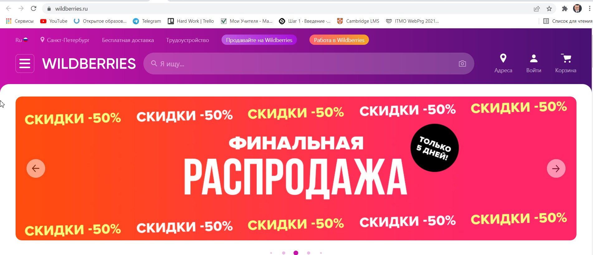
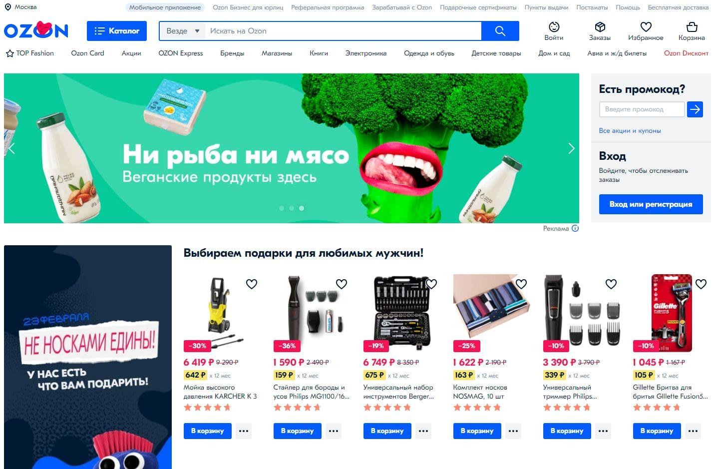
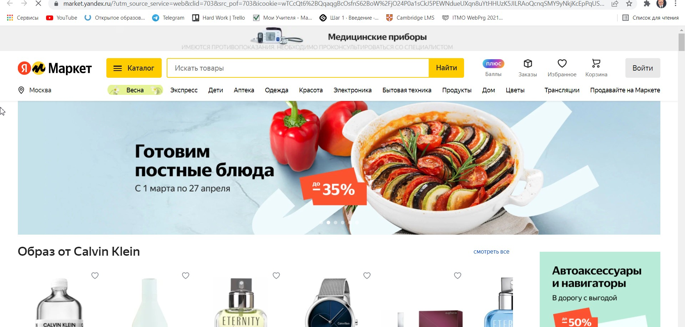

# HLO

**DnD-shop** — это интернет-сервис, где игроки в DnD могут покупать и продавать артефакт
Есть игроки. Они могут выставлять на продажу или покупать артефакты. При продаже можно поменять описание, выставить цену. У каждого продавца есть свой аккаунт, 
в котором указан весь инвентарь. При покупке можно искать по категориям. 

Пользователи с помощью веб-клиента (браузера) через HTTP-запросы работают с веб-приложением. 

# Архитектура
## Базы данных:
+ Таблица хранящая пользователей, id и пароли
+ Таблица хранящая инвентарь пользователей
+ Таблица для хранения всех предметов на продаже

# Аналоги
### Аналог 1

Сайт: https://www.wildberries.ru/

**Wildberries** — Один из самых популярных в России интернет-магазинов. Количество покупателей в 2020 составило 38.5 млн пользователей. Имеется поиск по фото. 
Имеется широкий спектр категорий. Категории могут делиться на подкатегории. Прибыль выплачивается каждую неделю. Товар продает сам продавец, мазагин предоставляет площадку. 15% комиссии

### Аналог 2

Сайт: https://www.ozon.ru/

**Ozon** — Также один из самых популярных в России интернет-магазинов. Количество покупателей в 2020 составило 13.8 млн пользователей. Имеется широкий спектр категорий.
Категории могут делиться на подкатегории. Прибыль выплачивается каждый месяц. Товар продает магазин без вашего участия. Не фиксированная комиссия. От 5% до 35%

### Аналог 3  

Сайт: https://market.yandex.ru/

**Yandex.market** — Наименее популярный из троицы онлайн-магазин. В 2020 количество покупателей составило 6 млн. пользователей Имеется широкий спектр категорий, а они также 
деляться на подкатегории. Система продажи такая же, как и у аналога 1. Прибыль выплачивается каждую неделю. Также требуются бумажные документы, значит нельзя работать в чистом 
онлайне. Фиксировання комиссия на категории, от 2 до 20%.

### Общие черты:
Во всех маркетах предоставляется выбор категорий, которые подразделяются на свои категории (например, одежда > мужская одежда). Присутствует регистрация и реклама.  

## Сравнение

### Критерии
- Наличие категорий (0 - нет категорий, 1 - есть  категории, 2 - есть категории по категориям) 

| Сервис | Веб-сайт | Наличие категорий | Наличие рекламы | Комиссия | Описание товара | продажа артефактов |
| ------ | -------- | ----------------- | ------------------------------ | ------------------------ | ------------------------------------- | ----------------- |
| Wildberries |https://www.wildberries.ru/ | 2 | Да | 15% | да | нет |
| Ozon | https://www.ozon.ru/ | 2 | Да | 5-35% | да | нет |
| Yandex.market | https://market.yandex.ru/ | 2 | Да | 2-20% | да | Нет |

### Вывод:
Сайт предоставит возможности купле-продажи товаров с различными категориями. Отличием же от конкурентов станет отсутствие комиссионных и рекламы. Ну и продажа артефактов.
