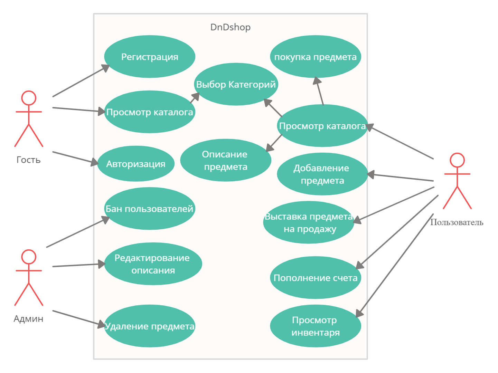

# Прецеденты использования

## Список акторов
### Гость
+ Регистрация
+ Авторизация
+ Просмотр каталога
   + Выбор категорий 
### Пользователь
+ Доступ к просмотру инвентаря
+ Просмотр каталога
   + Доступ к описанию предметов
   + Покупка предмета
   + Выбор категорий
+ Выставление предмета на продажу
+ Добавление предмета
+ Пополнение счета (номинальное, можно просто добавить золота. Нужно для поддержания баланса в игре)
### Администратор
+ Редактирование описания
+ Бан пользователей
+ Удаление предметов
## Диаграмма прецедентов использования

## Спецификация прецедентов использования

| Прецедент использования | Регистрация пользователя |
| :------------------     | :------------------ |
| Действующие лица        | Гость |
| Краткое описание        | Гость регестрирует новую учетную запись
| Предусловия             | - |                
| Основной поток          | Гость заполняет форму указав логин и пароль|
| Альтернативные потоки   | Если логин занят или если форма заполнена неверно, то выдается сообщение об ошибке|          
|Постусловия              | Если все верно, то создается новая учетная запись|

| Прецедент использования | Авторизация |
| :------------------     | :------------------ |
| Действующие лица        | Гость |
| Краткое описание        | Позволяет гостю войти в учетную запись |
| Предусловия             | - |                
| Основной поток          | Гость вводит логин и пароль в форму|
| Альтернативные потоки   | Если форма заполнена неверно, то гость получает сведения об ошибке|          
|Постусловия              | Если все верно, то гость авторизируется и становится пользователем|

| Прецедент использования | Просмотр каталога |
| :------------------     | :------------------ |
| Действующие лица        | Гость, пользователь |
| Краткое описание        | Позволяет посмотреть каталог |
| Предусловия             | - |                
| Основной поток          | Пользователь нажимает на каталог товаров |
| Альтернативные потоки   | - |          
|Постусловия              | Система показывает каталог |

| Прецедент использования | Выбор категорий  |
| :------------------     | :------------------ |
| Действующие лица        | Гость, пользователь |
| Краткое описание        | Позволяет выбрать категории для сортировки товаров |
| Предусловия             | нажать просмотр каталога |                
| Основной поток          | Пользователь может выбрать фильтры предметов используя кнопки интерфейса. |
| Альтернативные потоки   | - |          
|Постусловия              | Система сортирует и показывает категории с учётом пожеланий пользователя. |

| Прецедент использования | Описание предметов |
| :------------------     | :------------------ |
| Краткое описание        | Пользователь может просмотреть описание предмета |
| Предусловия             | нажать просмотр каталога |                     
| Основной поток          | Пользователь нажимает на предмет, чтобы просмотреть описание |
| Альтернативные потоки   | - |          
|Постусловия              | Система показывает описание предмета |

| Прецедент использования | Покупка предметов |
| :------------------     | :------------------ |
| Действующие лица        | пользователь |
| Краткое описание        | Пользователь покупает предмет |
| Предусловия             | посмотреть каталог предметов |                
| Основной поток          | Пользователь выбирает понравившийся предмет, после чего вылезает подтверждение и совершается покупка|
| Альтернативные потоки   | Если у пользователя недостаточно средств, то ему высвечивается сообщение, что он слишком бедный для этого |          
|Постусловия              | Средства пользователя отбавляются, а средства продавшего пользователя пополняются. Предмет появляется в инвентаре купившего |

| Прецедент использования | Просмотр инвентаря |
| :------------------     | :------------------ |
| Действующие лица        | пользователь |
| Краткое описание        | Позволяет посмотреть инвентарь |
| Предусловия             | - |                
| Основной поток          | Пользователь переходит в инвентарь |
| Альтернативные потоки   | - |          
|Постусловия              | Пользователь переходит в инвентарь |

| Прецедент использования | Пополнение счёта |
| :------------------     | :------------------ |
| Действующие лица        | пользователь |
| Краткое описание        | Позволяет добавить монеты |
| Предусловия             | открыть инвентарь |                
| Основной поток          | Пользователь добавляет монеты. Все это условность, так что надеюсь, вы не будете хитрить с изменением баланса  |
| Альтернативные потоки   | Если добавлена отрицательная сумма, то баланс уменьшиться. Если Число будет меньше 0, то количество монет будет равно 0 |          
|Постусловия              | Счёт пользователя меняется на введённую сумму |

| Прецедент использования | Добавление предмета |
| :------------------     | :------------------ |
| Действующие лица        | пользователь |
| Краткое описание        | Добавляет предмет в инвентарь |
| Предусловия             | Открыть инвентарь |                
| Основной поток          | Пользователь добавляет предмет, заполняя описание и название |
| Альтернативные потоки   | Если пользователь не указал название, то выдает ошибку |          
|Постусловия              | Предмет добавляется в инвентарь |

| Прецедент использования | Выставление предмета на продажу |
| :------------------     | :------------------ |
| Действующие лица        | пользователь |
| Краткое описание        | Пользователь выставляет товар на продажу |
| Предусловия             | иметь предмет в инвентаре |                
| Основной поток          | Пользователь нажимает на предмет в инвентаре и подтверждает продажу, после чего выставляет цену |
| Альтернативные потоки   | - |          
|Постусловия              | Предмет из инвентаря выставляется на продажу|

| Прецедент использования | Бан пользователя |
| :------------------     | :------------------ |
| Действующие лица        | Администратор |
| Краткое описание        | блокирует пользователя |
| Предусловия             | зайти в инвентарь пользователя |                
| Основной поток          | Аадминистратор нажимает кнопку забанить в инвентаре пользователя|
| Альтернативные потоки   | Администратор может разбанить пользователя, нажав кнопку разбанить |          
|Постусловия              | При обращении по адресу, по которому распологался инвентарь пользователя, любым пользователем, кроме администратора, пользователь получает сообщение "страница не найдена". Предметы выставленные на продажу пользователем скрываются |

| Прецедент использования | Редактирование описания |
| :------------------     | :------------------ |
| Действующие лица        | администратор |
| Краткое описание        | Позволяет изменить описание предмета |
| Предусловия             | - |                
| Основной поток          | Администратор нажимает кнопку возле предмета в каталоге изменить, после чего меняет описание предмета |
| Альтернативные потоки   | - |          
|Постусловия              | Описание предмета меняется |

| Прецедент использования | Удаление товара |
| :------------------     | :------------------ |
| Действующие лица        | администратор |
| Краткое описание        | удаляет предмет из инвентаря и каталога пользователя |
| Предусловия             | - |                
| Основной поток          | администратор нажимает кнопку удалить в каталоге предметов |
| Альтернативные потоки   | - |          
|Постусловия              | Предмет исчезает из инвентаря продающего и пропадает из каталога |

